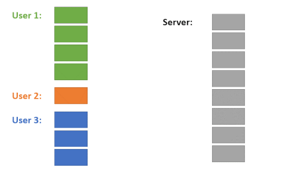
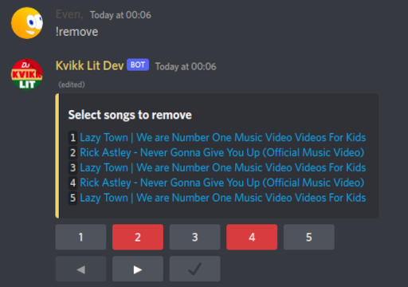

# Shite Music Bot

A discord music bot you can host yourself!

## Features

- Round Robin style queue, you won't have to wait forever for your songs to play.
- Interactive menus
- Translations, get the bot in your preferred language! Works for both commands and replies.
- Noice per server customization options, including per server localization.
- Toit embeds.
- DJ roles. Grants members in the role some more control over the queue.
- Sound-manipulation features, bass boost and nightcore.
- Lyrics command that sometimes gives the correct lyrics

### Fair queue behavior

Each user has their own queue and the bot mixes them together for fair time sharing.



### Interactive menus




## Requirements

- Python 3.10 or greater
- A [lavalink](https://github.com/Freyacodes/Lavalink) server

## Setup

1. Change or copy data/config.yaml.example to config.yaml
    - If using docker, the config file will be moved into `/data` on the first run.
2. Configure Lavalink
    - When self-hosting:
        - Get a `application.yml` file from your lavalink distribution, to provide lavalink.
        - Secure the instance by changing the password.
        - This bot is written with the Youtube, Soundcloud, Bandcamp and Vimeo source in mind. Others might work
    - Self-hosted and hosted:
        - Configure the bot to connect to your nodes.
        - If you wish to pre-seed the bot with lavalink nodes, you can do so in `data/config.yml`

          ```yml
          lavalink nodes:
            - host: localhost
              port: 2333
              password: youshallnotpass
              region: eu
              name: main
          ```

3. Add your bot token to `config.yaml`.
4. Prepare your environment:
    - Native install:
        - Clone, and enter the repository.
            - `git clone https://github.com/r-Norge/ShiteMusicBot.git && cd ShiteMusicBot`
        - (Recommended) Create a virtual environment and activate it.
            - `python3 -m pip venv .venv && . .venv/bin/activate`
        - Install requirements `python3 -m pip install -r requirements.txt`
    - Docker Compose:
        - Copy the example that fits your needs
        - Change the volume path(s) to store persistent data on your host.
        - `docker compose pull`
5. Run the bot:
    - Native install:
        - `python3 bot.py`
    - Docker Compose:
        - `docker compose run -d`
6. Make sure the bot responds, by invoking the info command. `@ShiteMusicBot info`, substitute `ShiteMusicBot` with the name of your bot.

### Docker Compose Example

#### Self-hosted lavalink

```yaml
version: '3'
networks:
  internal:
    driver: bridge

services:
    lavalink:
        hostname: lavalink
        image: ghcr.io/lavalink-devs/lavalink:4
        networks:
          - internal
        volumes:
          - ./application.yml:/opt/Lavalink/application.yml
    bot:
        container_name: ShiteMusicBot
        image: rnorge/music
        networks:
          - internal
        command: python3 bot.py
        volumes:
          - ./data:/app/data
```

#### Hosted lavalink

```yaml
version: '3'
services:
    bot:
        container_name: ShiteMusicBot
        image: rnorge/music
        command: python3 bot.py
        volumes:
          - ./data:/app/data
```
